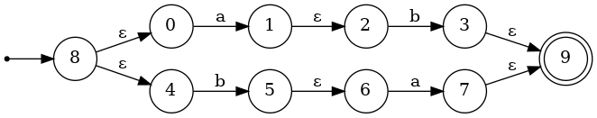
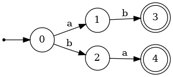
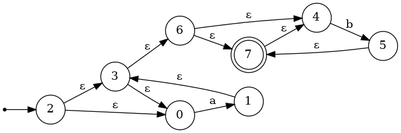
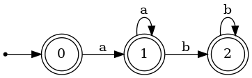
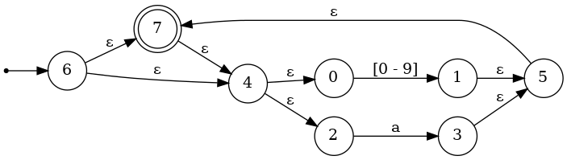
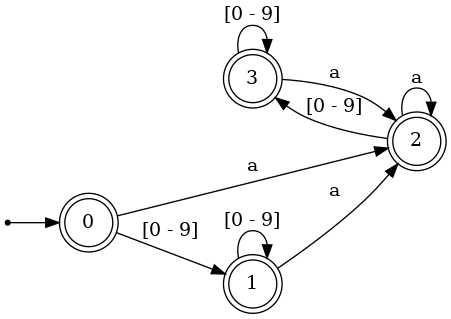
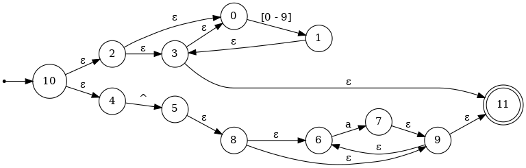
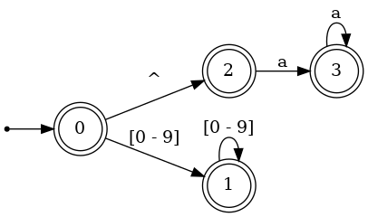

# A DFA-based Regular Expression Library for C++

## API

### Regular Expression Notations

The followings are the functions used for constructing regular expressions.

```cpp
RegularExpression::Ptr operator|(const RegularExpression::Ptr& x, const RegularExpression::Ptr& y);
RegularExpression::Ptr operator+(const RegularExpression::Ptr& x, const RegularExpression::Ptr& y);

RegularExpression::Ptr Symbol(char32_t c);
RegularExpression::Ptr Literal(const u32string& text);
RegularExpression::Ptr Range(char32_t lower, char32_t upper);
RegularExpression::Ptr LineBegin();
RegularExpression::Ptr LineEnd();
RegularExpression::Ptr RepeatExactly(const RegularExpression::Ptr& x, int times);
RegularExpression::Ptr RepeatAtLeast(const RegularExpression::Ptr& x, int times);
RegularExpression::Ptr Repeat(const RegularExpression::Ptr& x, int atLeast, int atMost);
```

### Use Regular Expressions

After compiling the regular expressions to DFA matrices, you can use the member functions of DFA matrix to match string patterns.

```cpp
bool DFAMatrix::FullMatch(const u32string& str) const;
int DFAMatrix::Search(const u32string& str) const;
int DFAMatrix::Match(const u32string& str, size_t startPos, size_t endPos, bool greedyMode) const;
```

## Examples

### Basic Usage

```cpp
#include <iostream>
#include <NFA.hpp>

using std::cout;
using std::endl;
using namespace regex::notations;

int main() {
  auto e = (Symbol(U'a') + Symbol(U'b')) | (Symbol(U'b') + Symbol(U'a'));
  auto matrix = e->Compile();
  if (matrix.FullMatch(U"ab")) {
    cout << "matched" << endl;
  } else {
    cout << "not matched" << endl;
  }
  return 0;
}
```

### Expression

```cpp
auto e1 = (Symbol(U'a') + Symbol(U'b')) | (Symbol(U'b') + Symbol(U'a'));
```

### NFA



### DFA



### Expression

```cpp
auto e2 = Symbol(U'a')->Many() + Symbol(U'b')->Many();
```

### NFA



### DFA



### Expression

```cpp
auto e3 = (Range(U'0', U'9') | Symbol(U'a'))->Many();
```

### NFA



### DFA


### Expression

```cpp
auto e4 = (Range(U'0', U'9')->Many() | (LineBegin() + Symbol(U'a')->Many()));
```

### NFA



### DFA
